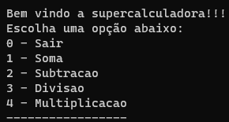

## Calculadora de Prompt em C#

Projeto criado pra praticar alguns conceitos básicos do C#.  
Realizado durante as aulas do Balta.io.

## Como executar o projeto:

Após realizar o clone do repositório executar o `dotnet build` ou `dotnet run`.

## Programa em execução:

